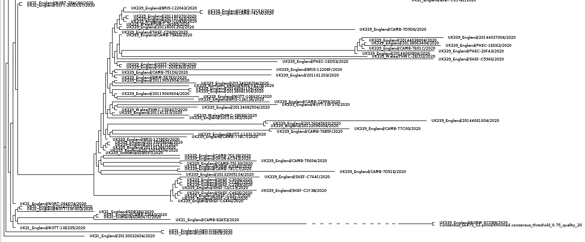
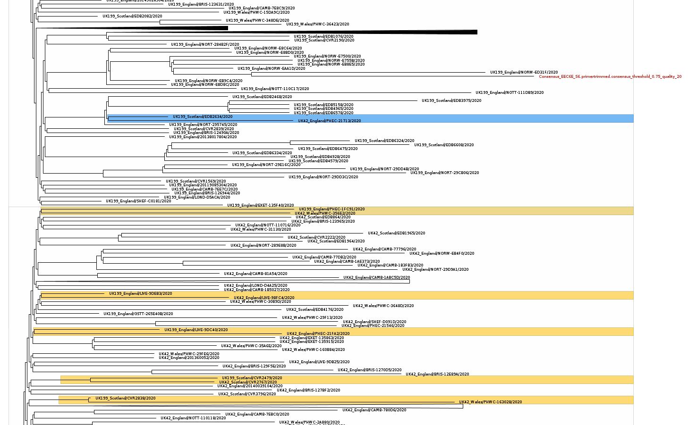
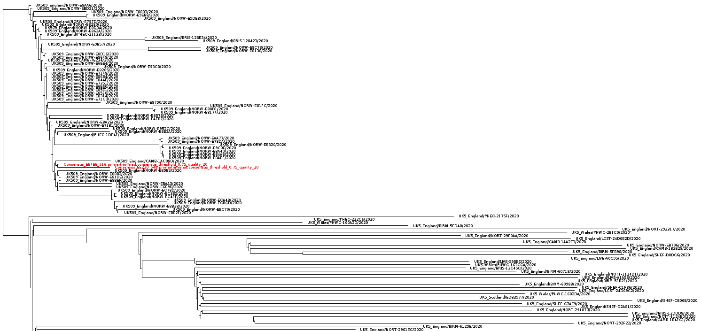
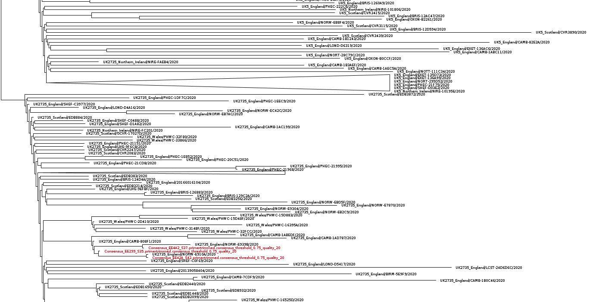
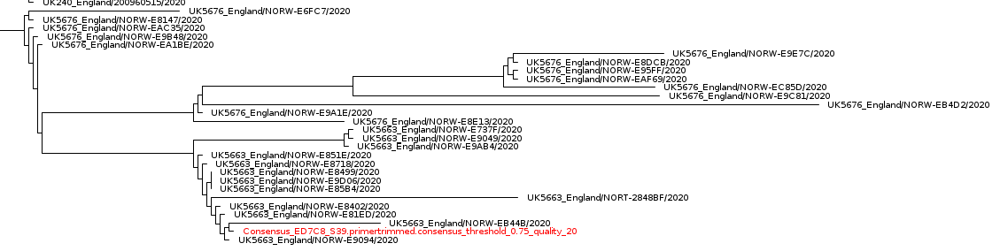
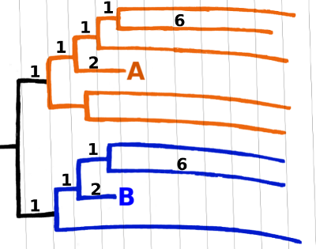

---
title: "2020.07.10 &mdash; Comparison between CIVET and PEROBA uk_lineage classification"
date: "2020-07-10"
css:
- pandoc.css
to: html5
from: markdown
...

I noticed that some local sequences had disagreeing classification between [civet](https://github.com/COG-UK/civet)
 and [peroba](https://github.com/quadram-institute-bioscience/peroba), and decided to see
which was more correct.
Fortunately for each UK_lineage the phylogenetics pipeline generates an alignment and a tree. 
Therefore, for each set of potential uk_lineages for a given sample, we can merge their (aligned) sequences and see
where where in the tree the sample would go (after a profile alignment against the provided alignment).

As a reminder, `civet` reports the closest sequence in the COGUK database to each sample, while `peroba` reports a
parsimony reconstructed state based on the sequences closest on the tree.
In all fairness `civet` is not a tool for UK_lineage classification but for visualisation &mdash; they use the closest neighbour 
as a "seed" to chose which leaves to show on the tree.

## Details

For all samples where there is disagreement between the classifications I ran a full phylogenetic analysis (subsampling
large lineages by hand or using iqtree PD mode), including the query sample. By visual inspection I could see which is
the most likely lineage. 
In total there is one case where peroba failed (by refusing to assign a lineage), 5 cases where civet failed, 
and 2 inconclusive cases, where peroba was better but it wasn't a clear-cut scenario.

### complex scenarios

An interesting case is `NORW-EE475` where we may be observing a paraphyly on clade UK31: it appears sister to
NORW-ECDB8, which is UK339. However both are within UK31 (therefore UK31 is not monophyletic). 
This indicates that the UK_lineage classification of `NORW-ECDB8` as UK339 by the COGUK pipeline may be wrong (or that
there is some masking in the COGUK pipeline not captured here)
 

 
Another interesting case is `NORW-EEC6E`: it belongs to same patient as `NORW-ED36A` which has been classified as UK42
(favouring peroba classification).
However if we neglect the patient history and just look at the tree, then it is closer to UK199 as inferred by civet.
This is because there is a good amount of paraphyly: in the figure below the blue clade show a UK42 within a UK199
cluster, and the yellow clades show a UK199 below an otherwise UK42 clade. 

 

### other comparisons
Below we show simpler cases, starting by the two sets where peroba inferred correctly the UK lineage: `EE220` and
`EE4EE` were inferred as UK509 by peroba but as UK5 by civet. 
  

 
And `EE299`, `EE42A`, and `EE4A2` which were classified as UK2735 by peroba but (again) as UK5 by civet. UK5 seems to be
a placeholder lineage (quite long branches, maybe due to partially ambiguous sites?)... 

 
And finally the one case where peroba failed to find the closest lineage, `ED7C8`. I tried with different subsamplings and
sometimes it did clustered with the wrong lineage.
More importantly the classification given by peroba is `UK4/UK72/UK5676` which means that it could not classify with
certainty (when there are several possible assignments, I take only the first three, which indicates uncertainty)

## Table 
A table with the peroba and civet classifications for all sequences on this run is shown below. I also added a few
columns indicating if they disagree, and ultimately (after the full phylogenetic analysis) which classification is
better. and why. 

peroba_uk_lineage|civet uk_lineage|disagreement|peroba_lineage|peroba_phylotype|central_sample_id|collection_date|patient_group|which is better|comment (from tree)
|:------|:------|:------|:------|:------|:------|:------|:------|:------|------:|
UK4/UK72/UK5676|UK5663|YES|B|UK240_1/UK120_1.3/UK40_1.1|NORW-ED7C8|2020-04-24||civet|closer to 5663, not far from 5676
UK12|UK12||B.1.p11|UK12_1.3|NORW-EE3C3|2020-04-24|||
UK339|UK31|YES|B.3|UK339_1.5|NORW-EE475|2020-06-23||Peroba|closest in tree to UK339 but both within UK31 clade
|UK712|YES|||NORW-EEB61|2020-06-28|NORW-ED85C||patient_group not classified
UK6|UK6||B.1|UK6_1.1|NORW-EE27B|2020-04-24|||
UK6|UK6||B.1|UK6_1.1.1|NORW-EE2B7|2020-04-23|||
UK6|UK6||B.1|UK6_1.1|NORW-EE554|2020-04-24|||
UK6|UK6||B.1|UK6_1.1.1|NORW-EE800|2020-04-24|||
UK199|UK199||B.1.5.5|UK199_1.1|NORW-EE24E|2020-04-24|||
UK199|UK199||B.1.5.5|UK199_1|NORW-EE2E4|2020-04-24|||
UK199|UK199||B.1.5.5|UK199_1|NORW-EE369|2020-04-24|||
UK199|UK199||B.1.5.5|UK199_1.1|NORW-EE41B|2020-04-24|||
UK42|UK199|YES|B.1|UK42_1|NORW-EEC6E|2020-06-29|NORW-ED36A|peroba|patient_group is UK42 but sequence closer to UK199 
UK2735|UK5|YES|B.1.1|UK2735_1.17.1|NORW-EE299|2020-04-24||peroba|flatly within UK2735
UK5|UK5||B.1.1|UK5_1.285|NORW-EE30F|2020-04-24|||
UK5|UK5||B.1.1|UK5_1.1|NORW-EE4DF|2020-06-25|||
UK2735|UK5|YES|B.1.1|UK2735_1.17|NORW-EE42A|2020-04-24||peroba|flatly within UK2735
UK2735|UK5|YES|B.1.1|UK2735_1.17.1|NORW-EE4A2|2020-04-24||peroba|flatly within UK2735
UK5|UK5||B.1.1|UK5_1.202.1|NORW-EE23F|2020-04-24|||
UK5|UK5||B.1.1|UK5_1.202.1|NORW-EE40C|2020-04-24|||
UK5|UK5||B.1.1|UK5_1.202.1|NORW-EE439|2020-04-24|||
UK509|UK5|YES|B.1.1|UK509_1|NORW-EE4EE|2020-04-23||peroba|flatly within UK509
UK509|UK5|YES|B.1.1|UK509_1|NORW-EE220|2020-04-24||peroba|flatly within UK509
UK5|UK5||B.1.1|UK5_1.3.1|NORW-EE69D|2020-04-24|||
UK5|UK5||B.1.1|UK5_1.221|NORW-EE26C|2020-04-23|||
UK5|UK5||B.1.1|UK5_1.176.1|NORW-EE4FD|2020-04-24|||
|UK5||||NORW-EE4C0|2020-04-24|||
UK5|UK5||B.1.1|UK5_1|NORW-EE545|2020-04-24|||

## A note on pairwise distances
One problem of using pairwise comparisons is that closeness by itself is not a good classification proxy. 
<!--Silhouette scores and other clustering goodness-of-fit measures use all distances, for instance.  -->
One example is given in the figure below, where we have two clusters (lineages), blue and orange. 
The patristic distance (i.e. the path along the phylogeny) between A and B is smaller than each of them are from any sequence from
their own lineages.
Therefore if B is the query it would be classified as the same lineage as A, and vice versa.

What about comparing the sequences directly, instead of looking at the phylogeny? 
Then besides the problem raised above, we must keep in mind that the pairwise sequence 
comparison doesn't know which changes are "relevant" &mdash; i.e. which are shared within the lineage and which are
'spurious' (homoplasic etc.).
Therefore two target sequences equally distant to the query might disagree in important sites.
Compounded to this is the fact that sequences have ambigous sites (e.g. `N`) which are treated as another state by
`minimap2` and friends.
Therefore the sequence "closest" to our query might just be the one with the most similar pattern of `N`s. 
And unfortunately a dictionary of lineage-defining positions doesn't seem to be possible to find (this is the so-called
*perfect phylogeny* problem).

Peroba tries to circumvent this by assigning a lineage to all internal nodes, while allowing for uncertainty (e.g.
nodes close to the root...)
<!--(that is why all modern phylogenetic methods were developed in the first place!)-->
