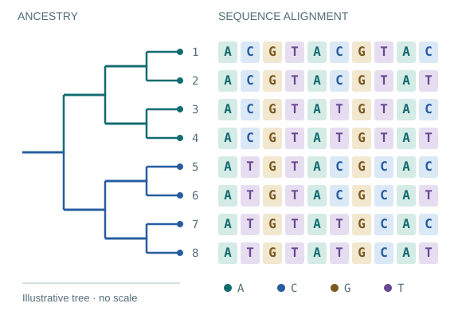

::: {.home-hero}
::: {.hero-copy}
[COMPUTATIONAL BIOLOGY / EVOLUTIONARY GENOMICS]{.eyebrow}

# Understanding evolution. [Building the tools.]{.accent}

I’m Leo Martins, a Bayesian Data Engineer at the University of Liverpool. I develop models to understand how genomes evolve, 
in order to help solving healthcare problems.

::: {.hero-actions}
[Explore my projects →](projects/index.md){.primary-link}
[Read the blog](blog/index.md){.text-link}
:::

[Models, algorithms, and notes from the workbench.]{.hero-note}
:::

::: {.hero-science}
[SHARED HISTORY / DIVERGING OBJECTS]{.eyebrow}

[A shared evolutionary history describe how genomes evolve.]{.figure-note}
:::
:::

::: {.home-section}
::: {.section-heading}
[01 / SOFTWARE]{.eyebrow}

## From biological questions to working code.

[All projects →](projects/index.md){.text-link}
:::

::: {.project-grid}
::: {.project-card}
[C / PHYLOGENETICS]{.project-kind}

### [biomcmc-lib](https://github.com/leomrtns/biomcmc-lib)

Low-level building blocks for phylogenetic analyses, from k-mers and hashing to tree algorithms.

[Source code ↗](https://github.com/leomrtns/biomcmc-lib) · [API documentation](doxygen-biomcmclib/index.html)
:::
::: {.project-card}
[SEQUENCES / SEARCH]{.project-kind}

### [Uvaia](https://github.com/leomrtns/uvaia)

Reference-based alignment and search against an aligned sequence database.

[Source code ↗](https://github.com/leomrtns/uvaia)
:::
::: {.project-card}
[BAYESIAN MODELS / SPECIES TREES]{.project-kind}

### [Guenomu](https://bitbucket.org/leomrtns/guenomu/)

Hierarchical Bayesian species tree estimation from multiple gene families.

[Source code ↗](https://bitbucket.org/leomrtns/guenomu/)
:::
:::
:::

::: {.home-section .writing-section}
::: {.section-heading}
[02 / WRITING]{.eyebrow}

## Notes from the workbench.

[All writing & RSS →](blog/index.md){.text-link}
:::

::: {.writing-list}
::: {.writing-row}
[5 JAN 2026 / PERSONAL]{.writing-date}

### [Back to blogging](posts/260105-back-to-blogging/index.md)

On keeping a lasting record of ideas and conversations.
:::
::: {.writing-row}
[16 AUG 2022 / PHYLOGENETICS]{.writing-date}

### [Not all invariant sites are created the same](posts/220816-invariant-sites/index.md)

Why removing invariant sites is usually a bad idea for maximum likelihood tree inference.
:::
::: {.writing-row}
[1 FEB 2022 / ALGORITHMS]{.writing-date}

### [Minimal example of a rolling hash](posts/220201-rolling-hash/index.ipynb)

A notebook exploring a rolling-hash implementation in biomcmc-lib.
:::
:::
:::
